# Editable-Reports-with-Power-Apps-Databricks
This is an instructional repository of how to enable the ability to edit data in Azure Databricks Delta tables via an embedded Power App via a Power Automate Cloud Flow, all from within a Power BI report that uses Direct Query against a Databricks Serverless SQL compute engine.  

## Introduction
A few years ago I documented the step of how to do this with an Azure SQL database at [Editable-Reports-with-Power-Apps](https://github.com/jcbendernh/Editable-Reports-with-Power-Apps/edit/main/README.md).  Given the new functionality released within the Power Platform with reagrds to Azure Databricks Connectors, you can now do the same with an Azure Databricks environment.

For this example, I am using the golddb.Products delta table within an Azure Databricks Unity Catalog.  

## src folder
- **products.csv** 
    - This contains the data we will use to upload to an Azure Databricks Volume within Unity Catalog and then create a delta table from that volume.
- **Databricks Flow and Apps Power Automate Solution file**
    - **Products - Databricks Canvas App** - This is used for exploratory purposes to understand how the Cloud Flows operate using the [Execute SQL Commands](https://learn.microsoft.com/en-us/connectors/databricks/#execute-a-sql-statement). This is not used in the report and I left it in the solution in case you want to explore this functionality further.
    - **ReadDatabricksGoldProducts - Cloud Flow** - This utilizes the Execute SQL Command to read data from an Azure Databricks Delta table via a serverless SQL Warehouse compute.This is not used in the report. This is not used in the report and I left it in the solution in case you want to explore this functionality further.
    - **UpdateDatabricksGoldProducts - Cloud Flow** - This utilizes the Execute SQL Command to update data to back into the Azure Databricks Delta table from the values captured on the form.<BR>**This is utilized in the report**
    - Databricks Connection
- **Editable-Products-Databricks.pbix**
    - This is the Power BI Report we will publish to the service and add the Power App to.

## Architectural Overview
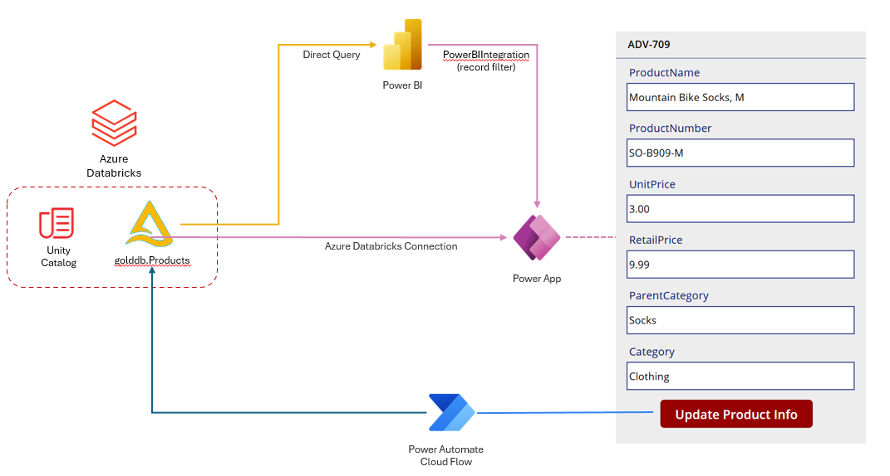

### Databricks
The Product data resides in a Delta table that is then served to both Power BI and the Power App and is updated via the Power Automate Cloud Flow.

### Power BI
- This reads the Product Delta table from Databricks via Direct Query
- A Power App is embedded in the report and we use the **PowerBIIntegration** function to filter the records within the Power App.

### Power App
- It is embedded within the Power BI Report via the web service / browser
- This reads the Product Delta table from Databricks via the Azure Databricks Connection Power Platform connector.
- Data is filtered to the selected row highlighted in the Poweer BI Report via the **PowerBIIntegration** function.
- The Product Delta table in Databricks is updated via a Power Automate Cloud Flow.

### Power Automate Cloud Flow
- Activated from the Power App
- Updates the Product Delta table in Databricks.


## Instructions

### Databricks

**IMPORTANT:** Please use/setup a serverless SQL Warehouse so that the startup time is in seconds and not minutes.  If you use a traditional SQL Warehouse, the Power Automate Cloud Flow will time out if the SQL warehouse is not started.  To create one, follow these instructions: [Create a SQL warehouse](https://learn.microsoft.com/en-us/azure/databricks/compute/sql-warehouse/create?source=recommendations)

1. Upload the [`products.csv`](./src/products.csv) to a volume within your Databricks Unity Catalog.  For instructions on how to do so, check out [Upload files to a Unity Catalog volume](https://learn.microsoft.com/en-us/azure/databricks/ingestion/file-upload/upload-to-volume).
2. Create a Python based notebook in your Databricks workspace and paste the following cells to read the products.csv and write the data to a new delta table in your Databricks catalog. <BR>
    ```python
    df = spark.read.option("header", "true").option("inferSchema", "true").csv("/Volumes/(catalog)/(schema)/products/products.csv")
    display(df)
    ```
    Replace (catalog) and (schema) with you catalog and schema.<br>

    ```python
    df.write.mode("overwrite").option("overwriteSchema", "true").saveAsTable("(catalog).(schema).products")
    ```
3. We need to make the ProductID field a non nullable primary key for the integration to work in this scenario.  To do so, paste the following cells into the notebook and run them.
    ```python
    %sql
    ALTER TABLE (catalog).(schema).products 
    ALTER COLUMN ProductID SET NOT NULL
    ```
    &nbsp;
    ```python
    %sql
    ALTER TABLE (catalog).(schema).products 
    ADD CONSTRAINT products_pk PRIMARY KEY (ProductID)
    ```

**NOTE:** Please remember your values for (catalog).(schema).products as we will use these later on for Power BI, Power Apps and Power Automate.

### Power Automate Setup

4. Import the [`DatabricksFlowsandApp`](src/DatabricksFlowsandApp_1_0_0_2.zip) solution file into your Power Platform environment via Solutions in Power Automate.  For instructions on how to do so, check out [Import a solution](https://learn.microsoft.com/en-us/power-automate/import-flow-solution).

5. During the import process, you will need to update the Databricks Connection Reference under **+ New Connection**.  On the Connect to Azure Databricks screen, set the following properties and click Create.

    |Field | Value |  
    |----------|----------|
    | Authentication Type: | OAuth Connection |
    | Server Hostname: | **Server hostname** value on **Connection details** tab of the Databricks SQL Warehouse.| 
    | HTTP Path: | **HTTP path** value on **Connection details** tab of the Databricks SQL Warehouse| 

6.  Once the solution is imported, we will need to change a few values on both the 
**ReadDatabricksGoldProducts** and 
**UpdateDatabricksGoldProducts** Cloud Flows.  Open each Cloud Flow within Power Automate and click **Edit** in the toolbar and change the following values in the Execute a SQL Statement item on the canvas.<BR>
    a. Body/warehouse_id - change the SQL Warehouse ID to reflect your enviroment.  This can be found on the **Overview** tab of the Databricks SQL Warehouse.| <BR>
    b. Body/statement - change the Databricks catalog and schema in the update statement to reflect your enviroment.<BR>
    c. Body/catalog - change the Databricks catalog value to reflect your enviroment.<BR>
    d. Body/schema - change the Databricks schema value to reflect your enviroment.<BR>

    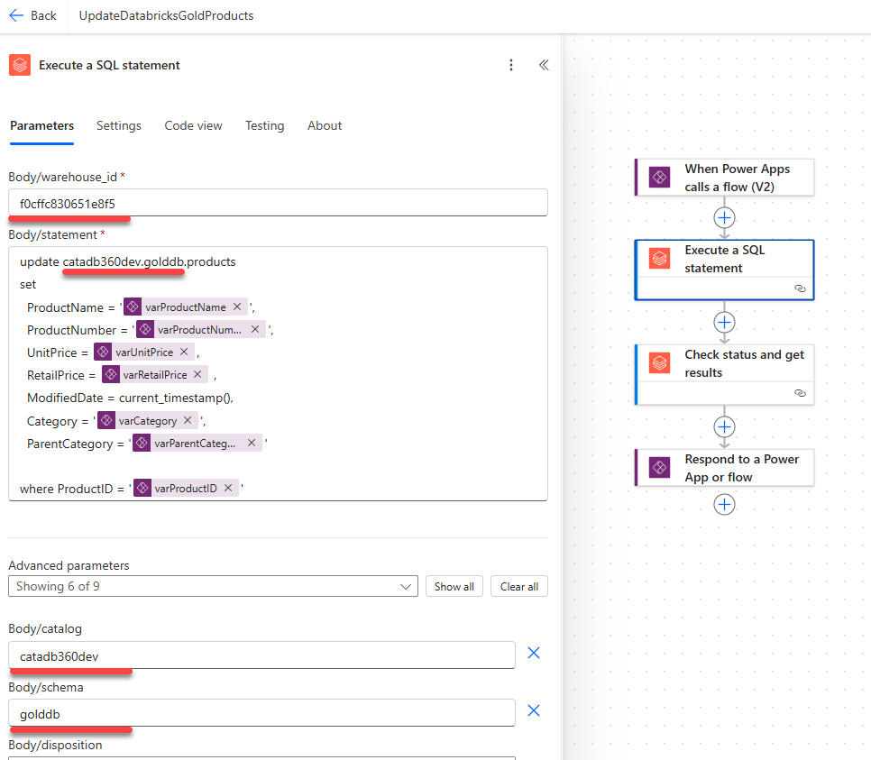
    

### Power BI Setup
7.  Download the [`Editable-Products-Databricks.pbix`](src/Editable-Products-Databricks.pbix) file to your local machine and open it with the Power BI Desktop.

8.  Once the report opens, click on **Transform Data** in the toolbar to open the Power Query Editor.  

9.  Within the Power Query editor, double click on the **Source** option under **Applied Steps** to modify our Databricks connection values. 

10.  Change the following values to match your environment.<BR>
    a. Server Hostname - **Server hostname** value on **Connection details** tab of the Databricks SQL Warehouse.<BR>
    b. HTTP Path - **HTTP path** value on **Connection details** tab of the Databricks SQL Warehouse.<BR>
    c. Default Catalog (Optional)<BR>
    d. Native query **schema** and **catalog** values in the select statement. <BR>

11. When finished click **OK** and you should see the Product Data in the data preview.  Next, click **Close & Apply** to save your changes in Power Query and return to the report.  When finished, the report should look like the following:
    

12. Publish the Report to a Fabric/Power BI Workspace.

13. Within your Fabric/Power BI Workspace, verify your credentials on the your **Editable-Products-Databricks** semantic model by going under **Settings** and then **Data source credentials** and **Edit credentials** and verify the following settings and click **Sign in**:<BR>
    |Field | Value |  
    |----------|----------|
    | Authentication Type: | OAuth2 |
    | Report viewers can only access...: | Checked | 

    

14. Go the **Editable-Products-Databricks** report in the workspace and verify that you can see the data in the report.

### Power App Setup

Showtime!  Now we will start to configure the Power App <-> Power BI Integration.

15. With the **Editable-Products-Databricks** report open in Fabric Portal, click the **Edit** which will open the Filters, Visualizations and Data panes to the right.

16. Select the **Power App for Power BI** control under the **Visualizations** pane to add it to the canvas of the report.
     

17. Resize the Power App control so that it takes up the right section of the report.

18. Next add the **ProductID** field (primary key) from the Data pane to the **PowerApps Data** control in the Visualization pane. This will change the appearance of the Power App control in the canvas and click the **Create New** button and then accept any popups to get you to the Power Apps Studio in a web browser.
     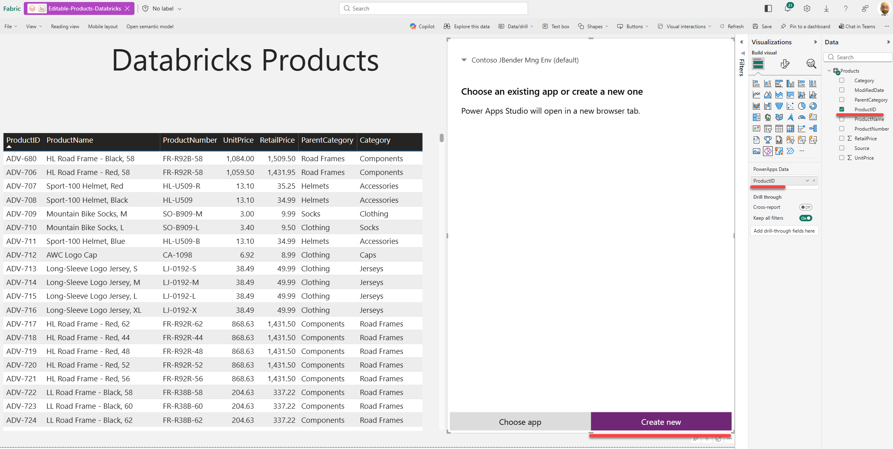

19.  Once in the Power Apps studio, it will create the form for you with a Gallery control listing all the ProductIDs. If you are not a Power Apps expert, it could get complicate quickly.  Thus, to keep it simple for these instructions, we will utilize a Form control and then embed the fields in the form along with a submit button to get our changes to post to Azure Databricks via the Power Automate Cloud Flow.

20.  Resize the **Gallery1** control on your **Screen1** in the Power App to only take up the heading of the screen. I resized it to the Height of 129 pixels.
     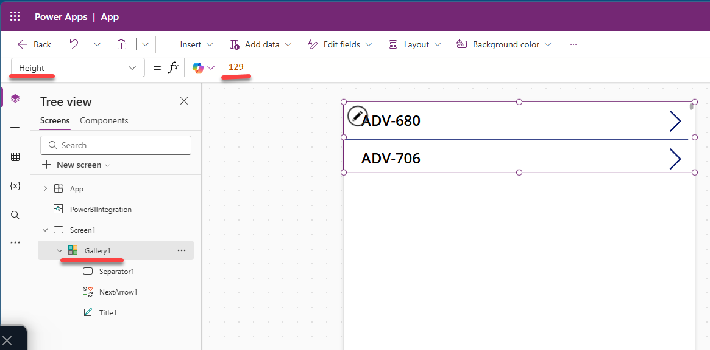

21. We will need to add an Azure Databricks connection to our data source so that the Power App can display the fields from Azure Databricks as necessary. It is important to understand this connection is independent of the Power BI datasource you created earlier. Later on we will tie the two together via a Power BI specific command.<BR>In the left navigation bar click on *Data* and then click the **Add data** button. and select **Azure Databricks** under **Connectors**.
     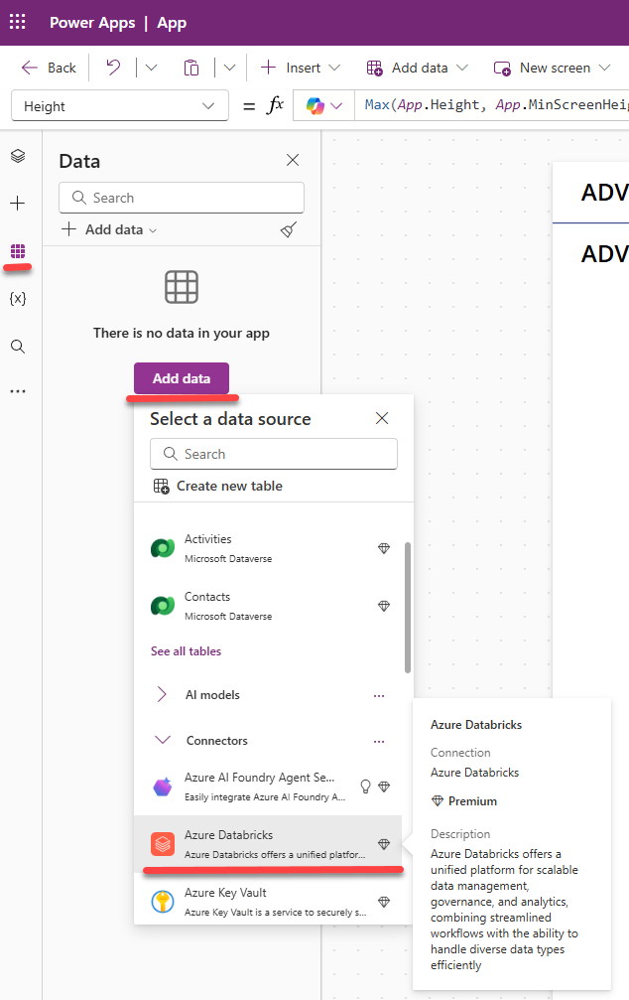

22. Under the Azure Databricks connection, set the following fields and click **Connect**.

    |Field | Value |  
    |----------|----------|
    | Authentication Type: | OAuth Connection |
    | Server Hostname: | **Server hostname** value on **Connection details** tab of the Databricks SQL Warehouse.| 
    | HTTP Path: | **HTTP path** value on **Connection details** tab of the Databricks SQL Warehouse| 

23. Under the choose a dataset control, select the Catalog  and then **(schema).Products** table and click **Connect**.  When finished your screen should look like the following.
     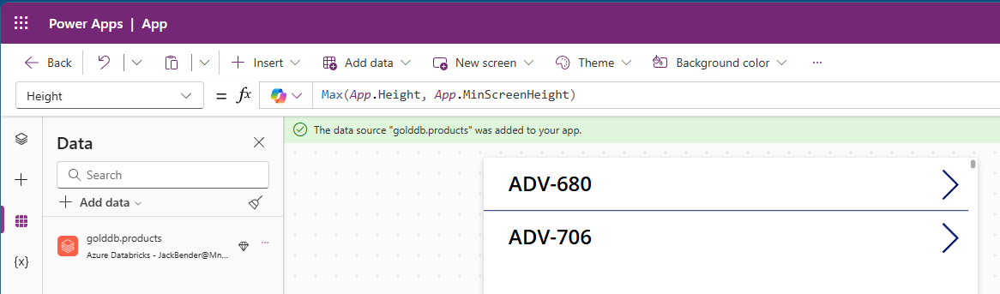

24. Insert an Edit Form on Screen1 of the Canvas app by select **+ Insert** in the toolbar and then select **Edit Form** and select our new Azure Databricks data source.

25. Let resize **Form1** so that it slightly overlaps the gallery. For positioning, I gave it a **Y value** of **75**.  When finished, it should look like the screen below.
     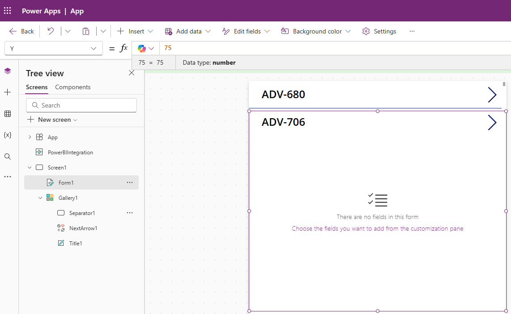

26.  Select **Choose the fields you want to add...** control and add the following fields in the **exact order**:
    a. ProductName - Edit text<BR>
    b. ProductNumber - Edit text<BR>
    c. UnitPrice - Edit number<BR>
    d. RetailPrice - Edit number<BR>
    e. ParentCategory - Edit text<BR>
    f. Category - Edit text<BR>

27. Next expand Form1 to a **Height** of **870**.  When finished, it should look like: 
     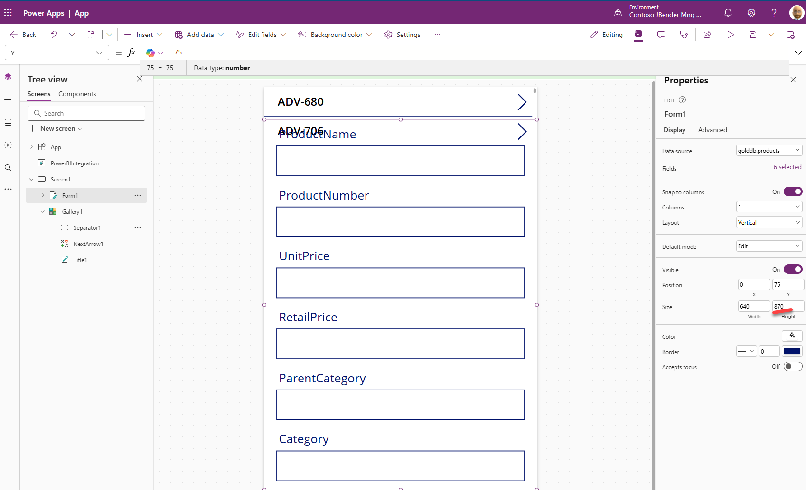

28. Next we need to tie the **Gallery1** control to the **Form1** control.  To do so, lets modify the following values on the **Advanced tab** of **Gallery1**. <br>
    a. OnSelect<BR>
    ```javascript
    Navigate(Form1, ScreenTransition.None)
    ```

    b. Items  
    ```javascript
    LookUp('schema.products', ProductID=First('PowerBIIntegration'.Data).ProductID)
    ```
        
    For example, I used<br>
    LookUp('golddb.products', ProductID=First('PowerBIIntegration'.Data).ProductID)<br>

29. Modify the **Item** value on the **Advanced** tab of **Form1**.
    ```javascript
    Gallery1.Selected
    ```
    Once this is set, you should start to see values populate in your fields that correspond to the record highlighted.
     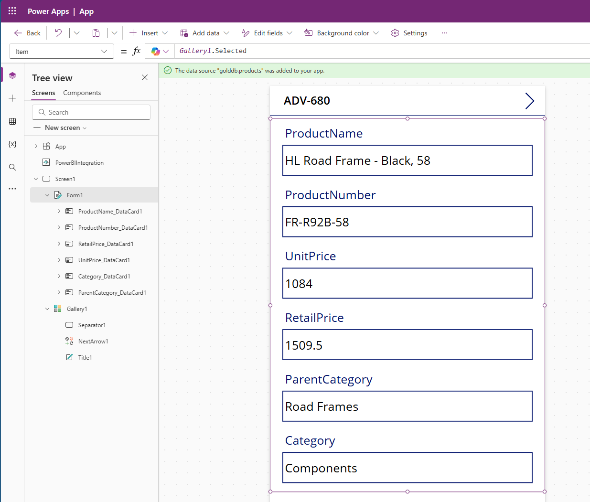

30. Lets Save our Power App to ensure we don't lose changes.  Click the **Save** button in the upper right ofo the toolbar and give it a title of **PowerBI-Databricks-Edit**.

31. In the left Navigation bar, double click Title1 under Gallery1 and rename it to
    ```javascript
    ProductIDLookup
    ```
    Also delete the **NextArrow1** control by Right clicking on it and selecting Delete.  When finished your Gallery1 items should look like
    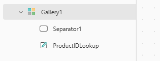

32. Now we need to update all the edit fields in the DataCard1 sections of Form1.  
    a. Expand **ProductName_DataCard1** section and change **DataCardValue1** value to 
    ```javascript
    edtProductName
    ```
    Do the same for the following fields:<br>&nbsp;<br>
    b. ProductNumber_DataCard1 - DataCardValue...
    ```javascript
    edtProductNumber
    ```
    c. UnitPrice_DataCard1 - DataCardValue...
    ```javascript
    edtUnitPrice
    ```
    d. RetailPrice_DataCard1 - DataCardValue...
    ```javascript
    edtRetailPrice
    ```
    e. ParentCategory_DataCard1 - DataCardValue...
    ```javascript
    edtParentCategory
    ```
    f. Category_DataCard1 - DataCardValue...
    ```javascript
    edtCategory
    ```
    When finished, your screen should look similar to:
    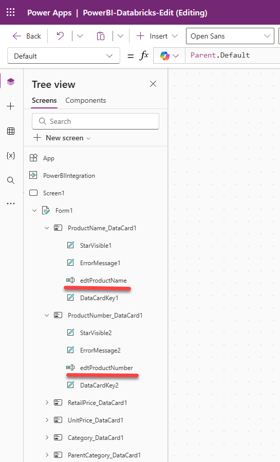

33. We need to add 2 controls to the bottom of **Screen1** below **Gallery1**.  
    a. Button - On the toolbar, click **+ Insert** and select **Button** and set the button properties to the following:
    |Property | Value |  
    |----------|----------|
    | Name | btnUpdate | 
    | Text | Update Product Info: |
    | Position X | 116 | 
    | Position Y | 955 | 
    | Size - Width | 400 | 
    | Size - Height | 70 | 
    
    b. Text Label - On the toolbar, click **+ Insert** and select **Text Label** and set the button properties to the following:
    |Property | Value |  
    |----------|----------|
    | Name | UpdateProductInfoStatus | 
    | Text | varUpdateMessage |
    | Position X | 50 | 
    | Position Y | 1040 | 
    | Size - Width | 560 | 
    | Size - Height | 70 | 

    When finished, your screen should look similar to:
    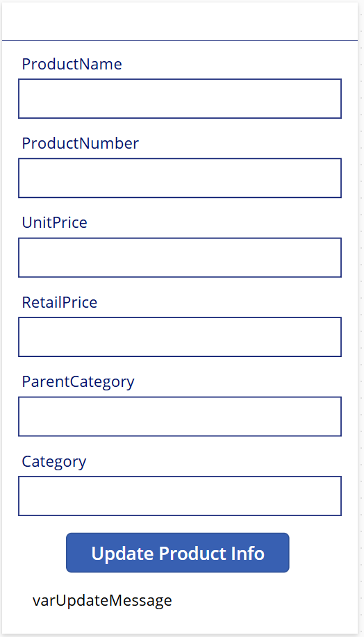

34. Now we need to send updates back to Azure Databricks. Our first step is to add the Power Automate Cloud Flow to the Power App.  To do so click on the **elipsis(...)** on the **left navigation bar** and select **Power Automate**.

35. Click **+ Add flow** and select **UpdateDatabricksGoldProducts** Cloud Flow.  When done, it should show in the listing.
    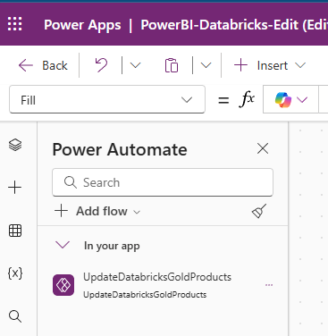

36. Our last step is to call the **UpdateDatabricksGoldProducts** Cloud Flow from our newly inserted button. To do so, select the button on the screen and add the following code to the **OnSelect** property.
    ```javascript
    // Reset state
    Set(varUpdateMessage, Blank());

    IfError(
        // Try: run the flow
        Set(
            varUpdateResponse,
            UpdateDatabricksGoldProducts.Run(
                ProductIDLookup.Text,
                edtProductName.Text,
                edtProductNumber.Text,
                Value(edtUnitPrice.Text, "en-US"),
                Value(edtRetailPrice.Text, "en-US"),
                edtCategory.Text,
                edtParentCategory.Text
            )
        );

        // If the flow call succeeds
        Set(varUpdateMessage, "Update succeeded"),

        // If the flow call errors
        Set(varUpdateMessage, "Update failed")
    );
    PowerBIIntegration.Refresh()
    ```

**IMPORTANT:** The order of fields in this formula above must exactly match the order of the fields in the **Parameters** tab of the **When Power Apps calls a flow (V2)** step of the **UpdateDatabricksGoldProducts** Cloud Flow.  Thus, if you change anything in these instructions you will need to make sure these orders match.
    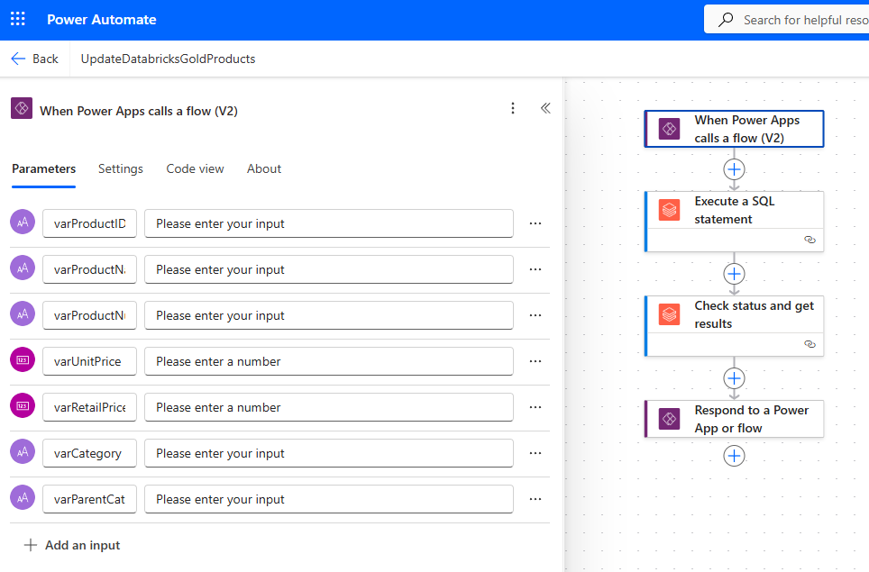

37. Edits are complete, **save the Power App** and then click **Publish** and select the **Publish this Version** on the pop-up screen.

38.  Return to the Power BI **Editable-Products-Databricks** report in the Fabric Workspace and click **Save** in the toolbar and then click **Reading View** in the toolbar

39. Refresh the browser and to test the report.  If prompted with an **Allow Power-BI-Databrick-Edit to access your data?** pop up, click **Allow**.

40. Select a row in the table and modify the a value in the Power App and click the Update Product Info button.  You should see the data change in the report as well.
    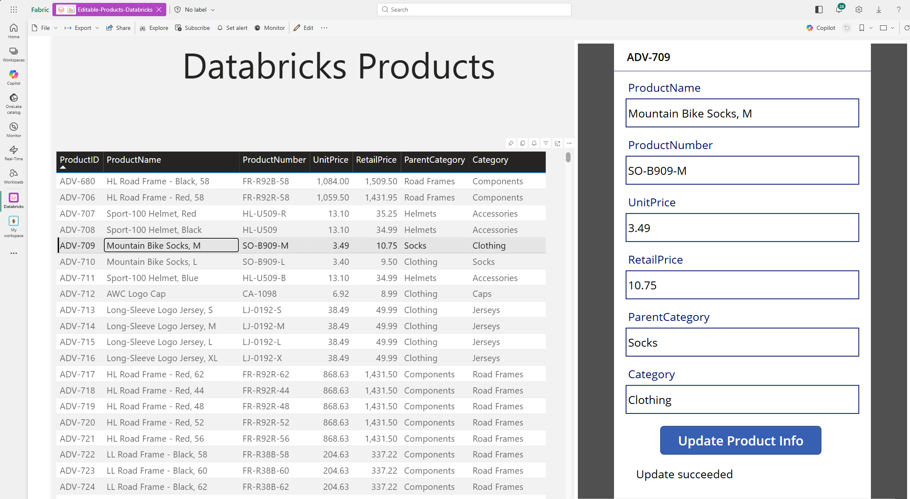

**NOTE:** You can add other advanced properties to the fields in the Power App to control advanced behavior.  For example, you can clear the update successful message at the bottom of the Power App by add the following value to the OnChange property of all the edt fields.
```javascript
Set(varUpdateMessage, Blank());
```

** Congratulations!  You have completed this tutorial **