# Editable-Reports-with-Power-Apps-Databricks
This repository showcases how to enable editing data in Azure Databricks Delta tables via an embedded Power App within Power BI.  

## Introduction
A few years ago, I documented the steps for doing this with an Azure SQL database at [Editable-Reports-with-Power-Apps](https://github.com/jcbendernh/Editable-Reports-with-Power-Apps/edit/main/README.md). With the recent Azure Databricks connector enhancements in the Power Platform, you can now achieve the same result in an Azure Databricks environment.

This repository contains a few items in the [src folder](./src/) that showcase what is already constructed so you do not have to build the Power BI Report, the Power App and the Power Automate Cloud flow from scratch.  We just need to go through some steps on how to integrate them and then review the various components.

For this example, I am using the golddb.Products delta table within an Azure Databricks Unity Catalog.  Instructions on how to create the delta table from the [products.csv](./src/products.csv) file in the src folder are listed below.  

## Architectural Overview
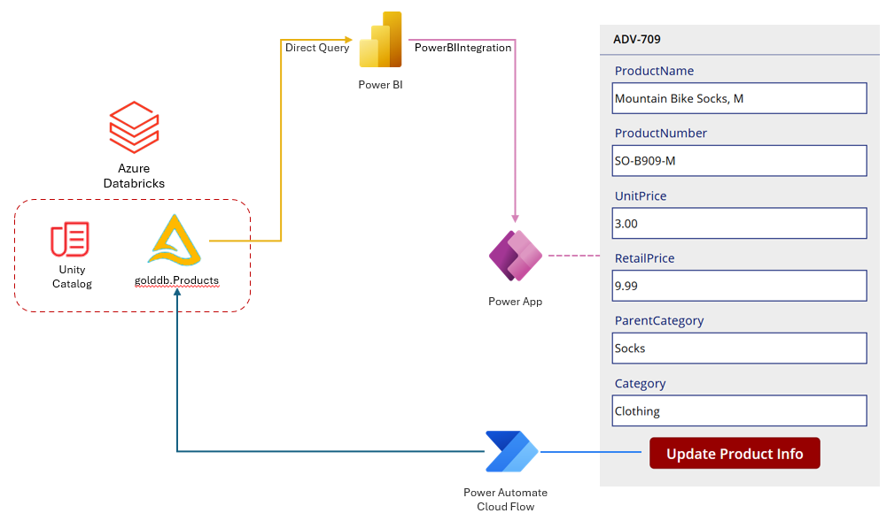

### Databricks
The Product data resides in a Delta table that is served to both the Power BI report and the Power App and is updated via the Power Automate Cloud Flow.

### Power BI
- This reads the Product Delta table from Databricks via Direct Query.
- A Power App is embedded in the report and we use the [PowerBIIntegration](https://learn.microsoft.com/en-us/power-apps/maker/canvas-apps/powerapps-custom-visual) capability to pass the product data to the Power App.

### Power App
- It is embedded within the Power BI Report.
- It reads the Product Delta table via the [PowerBIIntegration](https://learn.microsoft.com/en-us/power-apps/maker/canvas-apps/powerapps-custom-visual) capability from Power Bi.
- A button click in the Power App triggers the Power Automate Cloud Flow.

### Power Automate Cloud Flow
- Activated from the Power App
- It updates the Product Delta table in Databricks.


## src folder contents
- **products.csv** 
    - This contains the data we will use to upload to an Azure Databricks Volume within Unity Catalog and then create a delta table from that volume.
- **Power BI - Power App - Databricks Solution file**
    - **Products - Databricks Canvas App** - This will be inserted into the Power BI Report.  It reads data via the [PowerBIIntegration](https://learn.microsoft.com/en-us/power-apps/maker/canvas-apps/powerapps-custom-visual) capability from Power BI and updates the existing data in Databricks via the **UpdateDatabricksGoldProducts** - Cloud Flow.
    - **UpdateDatabricksGoldProducts - Cloud Flow** - This utilizes the [Execute SQL Commands](https://learn.microsoft.com/en-us/connectors/databricks/#execute-a-sql-statement) to update the data in Azure Databricks from the values captured on the Power Apps form.
    - **Databricks** Connection Reference - This is the Authentication Type, Server Hostname, and HTTP Path settings used to connect to the Databricks environment.
    - **dbxproductwarehouse_id** Environmental Variable - This is the Warehouse ID reference to the Serverless SQL compute in Databricks.
    - **dbxproductcatalog** Environmental Variable - This is the reference to the Databricks catalog of the products table.
    - **dbxproductschema** Environmental Variable - This is the reference to the Databricks schema of the products table.
- **Editable-Products-Databricks.pbix**
    - This is the Power BI Report we will publish to the service and add the Power App to.

## Instructions

### Databricks

**IMPORTANT:** Please utilize a serverless SQL Warehouse so that the startup time is in seconds and not minutes.  If you use a traditional SQL Warehouse, the Power Automate Cloud Flow will time out if the SQL warehouse is not started.  To create one, follow these instructions: [Create a SQL warehouse](https://learn.microsoft.com/en-us/azure/databricks/compute/sql-warehouse/create?source=recommendations)

1. Upload the [`products.csv`](./src/products.csv) to a volume within your Databricks Unity Catalog.  For instructions on how to do so, check out [Upload files to a Unity Catalog volume](https://learn.microsoft.com/en-us/azure/databricks/ingestion/file-upload/upload-to-volume).
2. Create a Python notebook in your Databricks workspace and paste the following cells to read the products.csv and write the data to a new delta table in your Databricks catalog. <BR>
    ```python
    df = spark.read.option("header", "true").option("inferSchema", "true").csv("/Volumes/(catalog)/(schema)/products/products.csv")
    display(df)
    ```
    Replace (catalog) and (schema) with your catalog and schema values.<br>

    ```python
    df.write.mode("overwrite").option("overwriteSchema", "true").saveAsTable("(catalog).(schema).products")
    ```
    Replace (catalog) and (schema) with your catalog and schema values.<br>

3. We need to make the ProductID field a non-nullable primary key for the integration to work without errors. To do so, paste the following cells into the notebook and run them.
    ```python
    %sql
    ALTER TABLE (catalog).(schema).products 
    ALTER COLUMN ProductID SET NOT NULL
    ```
    &nbsp;
    ```python
    %sql
    ALTER TABLE (catalog).(schema).products 
    ADD CONSTRAINT products_pk PRIMARY KEY (ProductID)
    ```

4. For our select statement that will be utilized by the Power BI report, we need to convert the timestamp field to a date field in the select statement as the Power BI report has issues with the Power Apps integration when Databricks timestamps with UTC offset are utilized. Thus, our SQL query will look like the following.

    ```sql
    select 
        ProductID,
        ProductName,
        ProductNumber,
        UnitPrice,
        RetailPrice,
        date(ModifiedDate) as ModifiedDate,
        Source,
        Category,
        ParentCategory
    from (catalog).(schema).products
    order by ProductID asc
    ```

**IMPORTANT:** All timestamp fields **must either be removed from the table listing in the Power BI report or converted to Date fields** if they need to be listed in the report.  Otherwise the [PowerBIIntegration](https://learn.microsoft.com/en-us/power-apps/maker/canvas-apps/powerapps-custom-visual) functionality will produce errors.

**NOTE:** Please remember your values for (catalog).(schema).products as we will use these later on.

### Solution File Import

5. Import the [`DatabricksFlowsandApp`](src/DatabricksFlowsandApp_1_0_0_5.zip) solution file into your Power Platform environment via **Solutions** in [Power Automate](https://make.powerautomate.com/).  For instructions on how to do so, check out [Import a solution](https://learn.microsoft.com/en-us/power-automate/import-flow-solution).

6. During the import process, you will need to update the Databricks Connection Reference under **Connections** and **Create new connection**.  On the **Connect to Azure Databricks** screen, set the following properties and click **Create**.

    |Field | Value |  
    |----------|----------|
    | Authentication Type: | OAuth Connection |
    | Server Hostname: | **Server hostname** value on **Connection details** tab of the Databricks SQL Warehouse.| 
    | HTTP Path: | **HTTP path** value on **Connection details** tab of the Databricks SQL Warehouse| 

7.  On the next screen, you will need to update 3 environmental variables.  These are used in the **UpdateDatabricksGoldProducts - Cloud Flow**.  Set the following properties and click **Import**.
    |Environmental Variable | Value |  
    |----------|----------|
    | dbxproductcatalog | The name of the Databricks **catalog** where the Product table resides |
    | dbxproductwarehouse_id | This can be found on the **Overview** tab of the SQL Warehouse within the Databricks Workspace | 
    | dbxproductschema | The name of the Databricks **schema** where the Product table resides | 

    NOTE:  This import is not instantaneous.  You will probably have to wait a few minutes for the following for it to show in the listing.  Once completed, you should see a screen like below.

    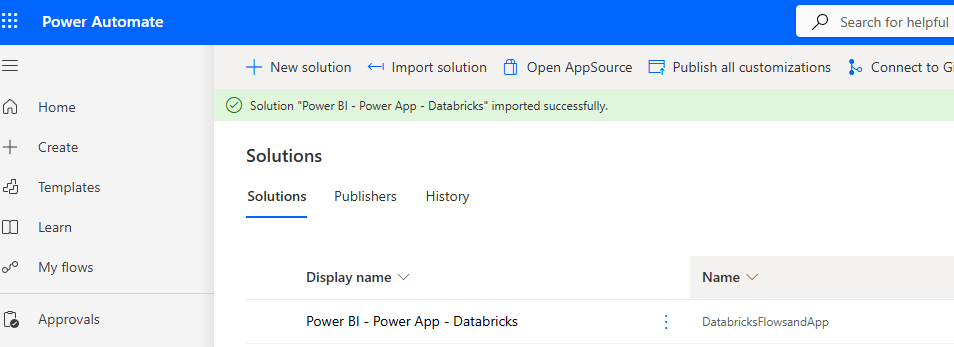
 

### Power BI Setup
8.  Download the [`Editable-Products-Databricks.pbix`](src/Editable-Products-Databricks.pbix) file to your local machine and open it with the Power BI Desktop.

9.  Once the report opens, click on **Transform Data** in the toolbar to open the Power Query Editor.  

10.  Within the Power Query editor, double-click the **Source** option under **Applied Steps** to modify our Databricks connection values. 

11.  Change the following values to match your environment.<BR>
    a. Server Hostname - **Server hostname** value on **Connection details** tab of the Databricks SQL Warehouse.<BR>
    b. HTTP Path - **HTTP path** value on **Connection details** tab of the Databricks SQL Warehouse.<BR>
    c. Default Catalog (Optional).  *It says optional, but it is not.*<BR>
    d. Native query **schema** and **catalog** values in the select statement. <BR>

12. When finished, click **OK** and you should see the Product Data in the data preview. Next, click **Close & Apply** to save your changes in Power Query and return to the report. When finished, the report should look like the following:<BR>
    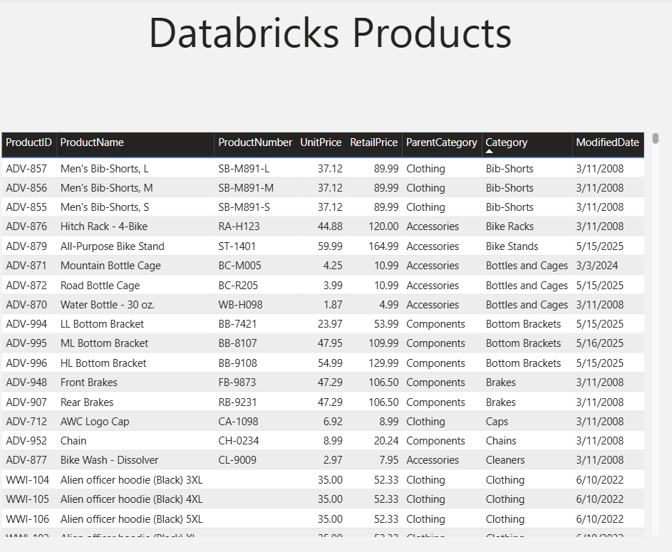

13. Publish the Report to a Fabric/Power BI Workspace.

14. Within your Fabric/Power BI Workspace, verify your credentials on your **Editable-Products-Databricks** semantic model by going under **Settings**, then **Data source credentials**, then **Edit credentials**. Verify the following settings and click **Sign in**:<BR>
    |Field | Value |  
    |----------|----------|
    | Authentication Type: | OAuth2 |
    | Report viewers can only access...: | Checked | 

    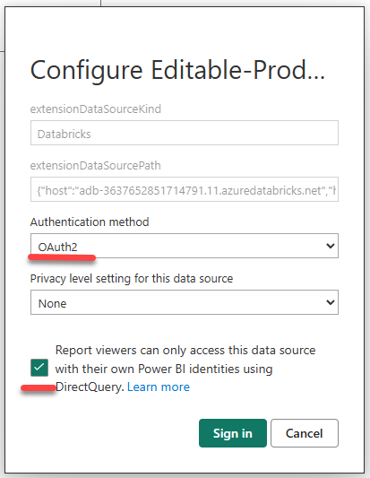

15. Go to the **Editable-Products-Databricks** report in the workspace and verify that you can see the data in the report.

### PowerBIIntegration Configuration

Showtime!  Now we will start to configure the Power App <-> Power BI Integration.

16. With the **Editable-Products-Databricks** report open in Fabric Portal, click the **Edit** which will open the Filters, Visualizations and Data panes to the right.

17. Select the **Power App for Power BI** control under the **Visualizations** pane to add it to the canvas of the report.
     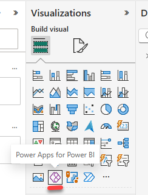

18. Resize the Power App control so that it takes up the right section of the report.

19. Next add the following fields to the **PowerApps Data** control in the Visualization Pane as they will be displayed in the Power App and sent through the Power Automate Cloud Flow to update the Databricks Delta table.<br>
    a. ProductID<br>
    b. ProductName<br>
    c. ProductNumber<br>
    d. UnitPrice - Change to don't summarize<br>
    e. RetailPrice - Change to don't summarize<br>
    f. ParentCategory<br>
    g. Category<br>
     
    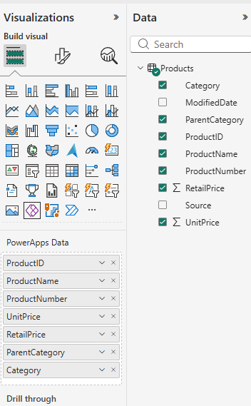


20. This will change the appearance of the Power App control on the canvas. Click the **Choose App** button, then accept any pop-ups to open Power Apps Studio in a web browser.
     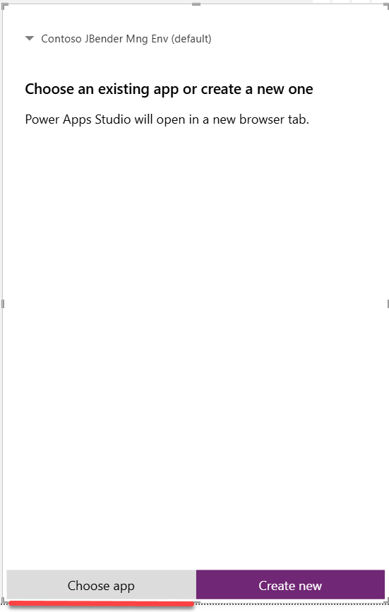

21. Select **Power BI - Databricks Form** from the listing and click **Add**.

22. At the next screen, click **Go to Power Apps Studio**.  It will open up a new tab with the Power App available.

23. Within the Power App window, click **Skip** at the Welcome to Power App Studio window to get to the App canvas.

24. We need to save the Power App to capture the new fields that come through via PowerBIIntegration. You will notice the save button is grayed out. Highlight the Update Product button and **move it to enable the Save button**. Click **Save** and then click **Publish**. You can close the Power Apps tab.
    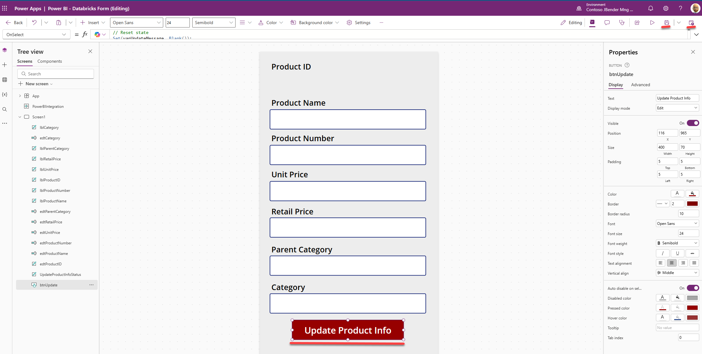

25.  Return to the Power BI interface and close **Save** in the toolbar and then click **Reading View**. 
    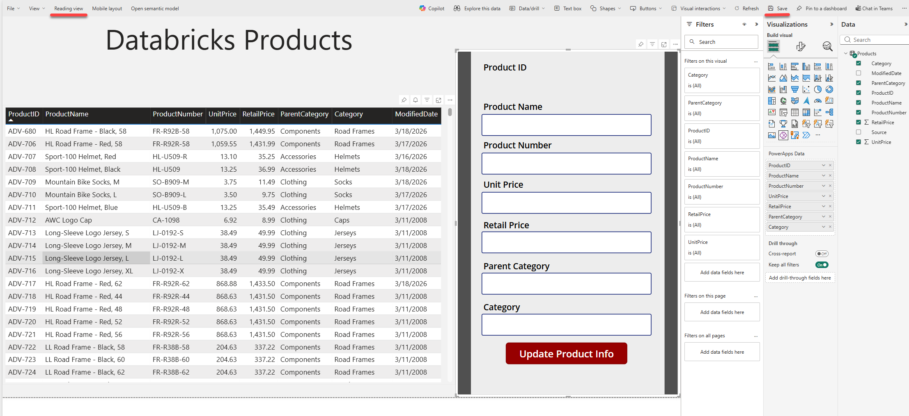

26.  You will now need to refresh the report in the browser for the new changes to take effect. Click a row in the table and the fields should populate in the Power App. 
    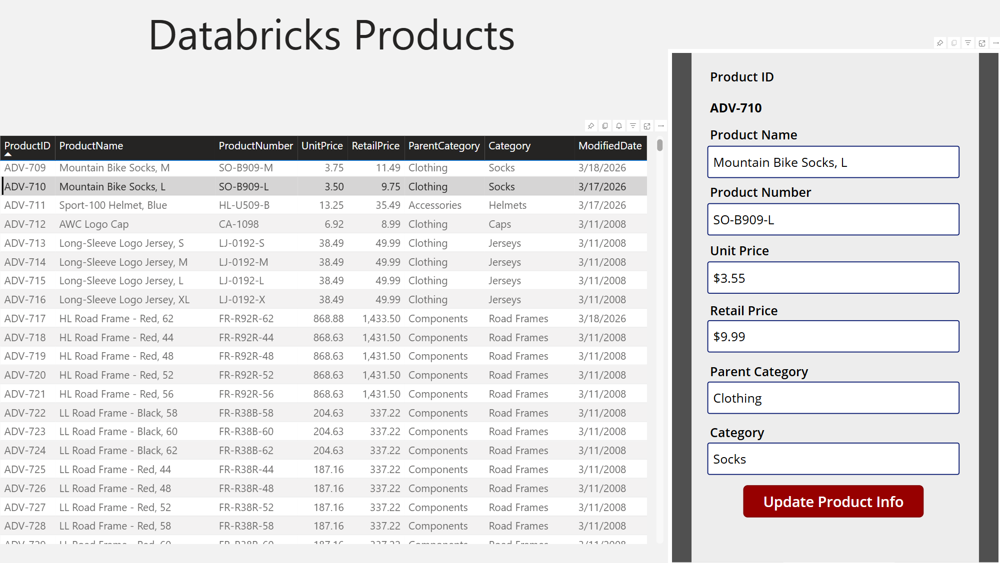

**Congratulations!  You have completed this tutorial**

## Appendix

### Power App Overview
This provides an overview of the components and their key properties. These showcase the selected record in the Power BI Report.
    
|Component | Value |  
|----------|----------|
| lblProductID | View-only label of the Product ID|
| edtProductName | Edit field of the Product Name |
| edtProductNumber | Edit field of the Product Number|
| edtUnitPrice | Edit field of the Unit Price numeric field|
| edtRetailPrice | Edit field of the Retail Price numeric field|
| edtParentCategory | Edit field of the Parent Category Name |
| edtCategory | Edit field of the Category|
| btnUpdate | When clicked, this triggers the UpdateDatabricksGoldProducts Power Automate Cloud Flow |
| UpdateProductInfoStatus | This shows the status of the update in Databricks when the button is clicked | 

There are quite a few formulas that are utilized in this app.  At the core of this, we filter the record with the following formula:

```javascript
First(PowerBIIntegration.Data).ProductID
```

If we just use this formula, the form is not responsive to navigation within Power BI and may confuse users, so we use the formula below on the **Default** property. It accounts for row count, meaning if no record is selected, the fields are blank.

```javascript
If(
    CountRows(PowerBIIntegration.Data) = 1,
    First(PowerBIIntegration.Data).ProductID,
    Blank()
)
```
For the numeric fields, we modify this formula a bit as they are currency fields.

```javascript
If(
    CountRows(PowerBIIntegration.Data) = 1,
    Text(
        First(PowerBIIntegration.Data).UnitPrice,
        "[$-en-US]$#,##0.00"
    ),
    Blank()
)
```

The action that occurs with the button click / **OnSelect** property is a bit more complex and has three parts to it.
- It first resets the **varUpdateMessage** status of the UpdateProductInfoStatus label to blank
- It submits the fields listed to the UpdateDatabricksGoldProducts Cloud Flow.<BR>
**IMPORTANT**: The order of these fields must match the order of the fields listed in the Parameters on the first step of the Power Automate Cloud Flow for the fields to save correctly.
- It updates the **varUpdateMessage** status of the UpdateProductInfoStatus label with the status of the UpdateDatabricksGoldProducts Cloud Flow.

```javascript
// Reset state
Set(varUpdateMessage, Blank());

IfError(
    // Try: run the flow
    Set(
        varUpdateResponse,
        UpdateDatabricksGoldProducts.Run(
            edtProductID.Text,
            edtProductName.Text,
            edtProductNumber.Text,
            Value(edtUnitPrice.Text, "en-US"),
            Value(edtRetailPrice.Text, "en-US"),
            edtParentCategory.Text,
            edtCategory.Text
        )
    );

    // If the flow call succeeds
    Set(varUpdateMessage, "Update succeeded"),

    // If the flow call errors
    Set(varUpdateMessage, "Update failed")
);
PowerBIIntegration.Refresh()
```

### Power Automate Overview

This Cloud Flow writes back to the Databricks Delta table in 4 steps.
1. **When Power Apps calls a flow (V2)**<BR>
This lists the Parameters which are the fields passed from the button click in the formula above.  <BR>
**IMPORTANT**: The order of these fields listed in the parameters must match the order of the fields passed in the button **OnSelect** statement in Power Apps for the fields to save correctly.<BR>

    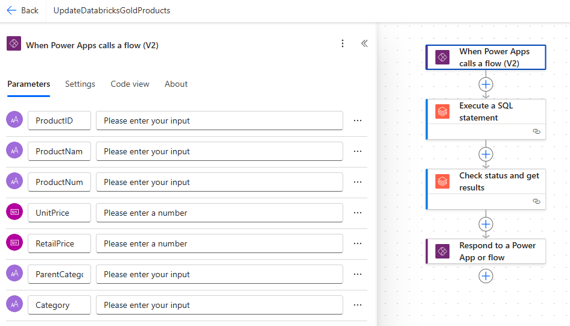

2.  **Execute a SQL statement**<BR>
This passes the fields to the Databricks SQL Compute to update the record in the Delta table.<BR>

    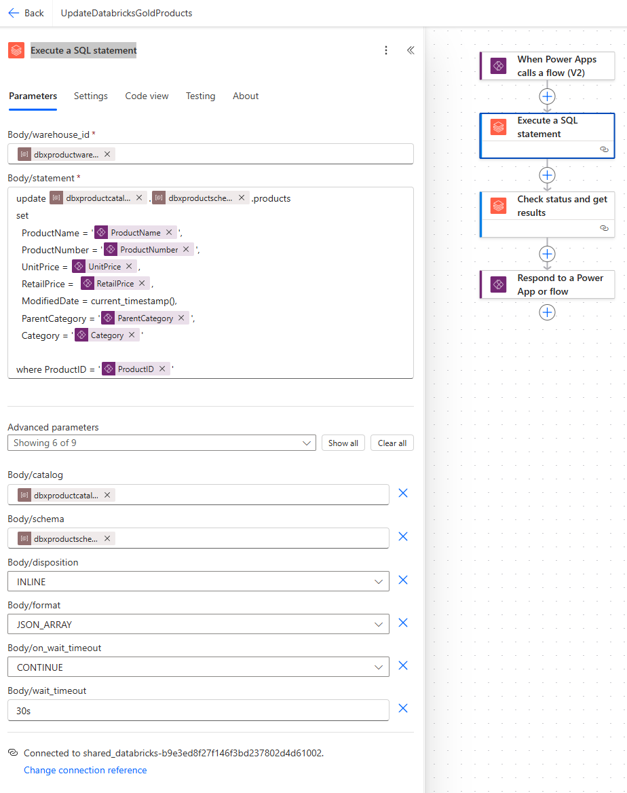

3. **Check status and get results**<BR>
This checks the status of the previous step, and that result can be passed to the last step.<BR>

    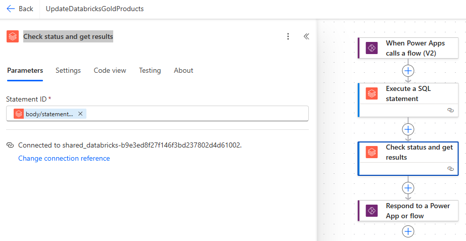

4. **Respond to a Power App or flow**<BR>
Takes the result of the previous step and passes it back to the Power App.<BR>

    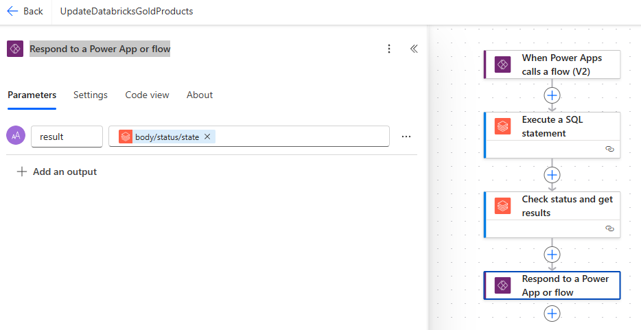
